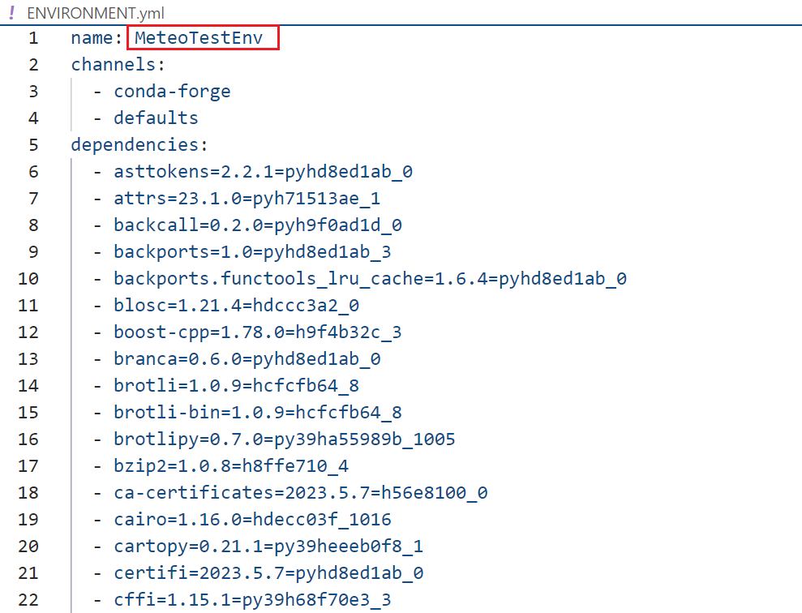
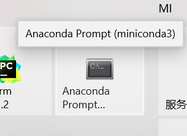
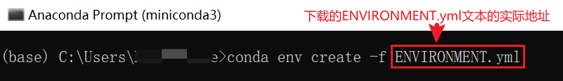

# MeteoPy依赖库说明

## MeteoPy测试环境说明

+ 使用`miniconda`环境，安装的python版本为`3.10`，下载地址：[Miniconda — conda documentation](https://docs.conda.io/en/latest/miniconda.html)；

  

+ 在miniconda中，创建虚拟环境，使用`python=3.9.16`；

  

## 环境配置（推荐）

在仓库主目录下，存有一个测试环境的备份文件[ENVIRONMENT.yml](./ENVIRONMENT.yml)，根据此文件可以直接移植我们的测试环境(python虚拟环境)。

+ 首先，根据1.1的方法安装`miniconda`，或者安装`anaconda`；

+ fork/下载/复制本仓库主目录下的[ENVIRONMENT.yml](./ENVIRONMENT.yml)文件；

+ 修改`ENVIRONMENT.yml`文件第一行，根据需要将`MeteoPyTestEnv`改成你喜欢的虚拟环境名称，可以不更改；

  

+ 进入`Anaconda Prompt`；

  

+ 输入`conda env create -f`+`下载的ENVIRONMENT.yml文件的实际地址`

  

  

## 绘图模块

在绘图模块`MeteoDraw`主要依赖如下python函数库，在使用绘图模块之前，要预先安装一下库：

+ matplotlib

+ cartopy

+ cnmaps

  ```
  >>> conda install -c conda-forge cnmaps==1.1.1
  ```

**注意：建议直接安装cnmaps，其他库会依赖安装**


[返回主README文件](./README.md)