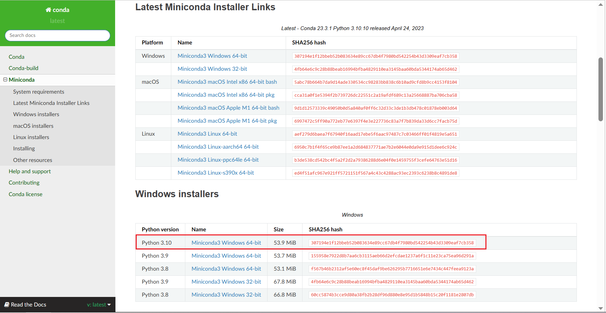
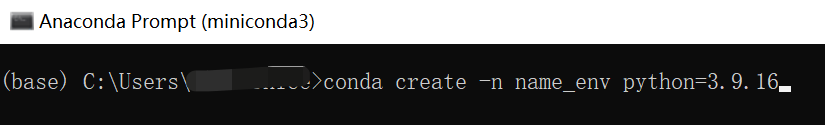

# MeteoPy依赖库说明

## MeteoPy测试环境说明

+ 使用`miniconda`环境，安装的python版本为`3.10`，下载地址：[Miniconda — conda documentation](https://docs.conda.io/en/latest/miniconda.html)；

  

+ 在miniconda中，创建虚拟环境，使用`python=3.9.16`；

  

## 绘图模块

在绘图模块`MeteoDraw`主要依赖如下python函数库，在使用绘图模块之前，要预先安装一下库：

+ matplotlib

+ cartopy

+ cnmaps

  ```
  >>> conda install -c conda-forge cnmaps==1.1.1
  ```

**注意：**建议直接安装cnmaps，其他库会依赖安装；

