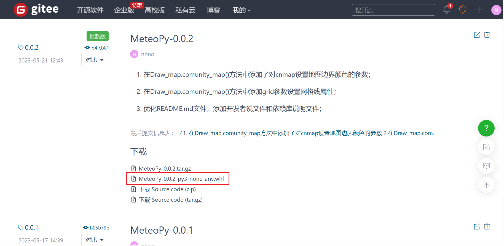
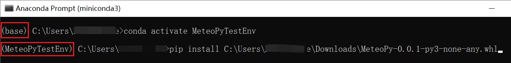

# MeteoPy
在此仓库中将存放一些我们在科研过程中实用的python脚本，主要针对大气科学学科。

## MeteoPy库如何下载

1. 首先进入本函数库的开源官网：https://gitee.com/MeteoTop/MeteoPy；

2. 在右侧栏找到“发行版”标签，点击进入发行版；

   

3. 选择你所需要下载的版本，点击对应版本下载`.whl`文件；

   

4. 本地安装MeteoPy库；

   + 如果像直接将MeteoPy库安装到本地的主python环境中，则打开cmd命令行，`pip install + 刚刚下载的whl文件地址`；

     

   + 如果想安装在conda的某个虚拟环境中，则先打开`Anaconda Prompt`，然后进入目标虚拟环境`conda activate **`，最后再`pip install + 刚刚下载的whl文件地址`;

     

     

     

**注意：不要，不要，不要直接`pip install MeteoPy`，因为在PyPI官网上有同名函数，所有直接下载的并不是我们这个MetetoPy**

## 函数库说明

此函数库中存有多个文件夹，初略可分为`功能文件夹`和`测试文件夹`。

+ 本函数库也依赖其他python库，详见[MeteoPy依赖库说明](./DEPENDENCE.md)；
+ 我们尝试将一些在科研中经常使用到的python程序封装成`函数`或者`类`，方便下次使用。如果有志同道合的朋友，愿意为本开源函数库做出贡献，请仔细阅读[开发者说明](./DEVELOPER.md)；

### Test

此文件夹为函数测试文件夹，其中的脚本用于测试其他功能文件夹中的脚本。

+ 该文件夹下建有与各功能文件夹相对应的子测试文件夹，命名：`功能文件夹名Test`；
+ 子测试文件夹下，建有针对每个功能py文件的测试文件，命名：`功能文件名Test.ipynb`；
+ 测试文件为`jupyter notebook`格式，方便图文并茂显示每一个示例；

### Tools

此文件夹为工具文件夹，属于功能文件夹。存放一些工具类函数，如地图白化、Lambert投影的坐标刻度显示等等。在此测试文件夹内又将工具函数分为三类，FileTools.py、FunVarDefault.py、GraphTools.py。

+ `FileTools.py`：主要存放一些操作文件的工具函数；
+ `FunVarDefault.py`：存放一些在定义函数时，变量初始化的工具函数；
+ `GraphTools.py`：存放一些在绘制图表过程中使用到工具函数；

[工具文件夹介绍](./MeteoPy/Tools/README.md)

### MeteoDraw

此文件夹为气象绘图文件夹，属于功能文件夹。存放一些绘图函数，主要可能偏向气象学。

[绘图文件夹介绍](./MeteoPy/MeteoDraw/README.md)

### DataPro

此文件夹为数据处理文件夹，属于功能文件夹。存放一些数据处理的函数。

[数据处理文件夹介绍](./MeteoPy/DataPro/README.md)

